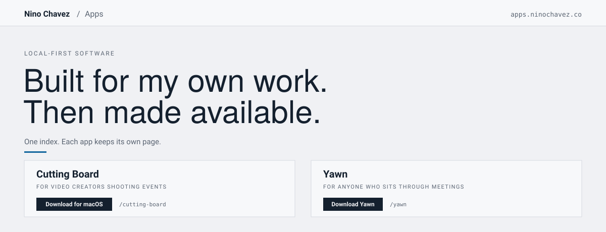

# apps-ninochavez

The index page at **[apps.ninochavez.co](https://apps.ninochavez.co)**. One page,
one job: say what these apps have in common and send you to the right one.

It does not host the apps. Each app keeps its own Pages project and its own page,
and [`apps-ninochavez-router`](https://github.com/nino-chavez/apps-ninochavez-router)
maps a path onto it.

## What's here

```
index.html              the whole site
assets/readme/          the hero above
```

One file, no build step, no dependencies. Open `index.html` to work on it.
The Yawn card is the exception: its public product copy and release metadata
load from Yawn's published `app-card.json` manifest. Keep the local fallback
generic and accurate; do not add a second hard-coded Yawn version here.

## Deploy

```bash
npx wrangler pages deploy . --project-name=apps-ninochavez --branch=main
```

The custom domain is served by the router Worker, not by this project directly —
so a deploy here changes the index and nothing else.

## Adding an app

Copy a `<article class="card">` block in `index.html` and fill in three things,
because those are the three questions a visitor actually has:

| Line | Answers |
|---|---|
| `.for` | who it is for |
| `.what` | what it does |
| `.foot` | what to do next |

Then add the route in the router repo. The grid wraps on its own; no layout work
is needed for a third or fourth card.

## Design

The palette and type are harvested from `ninochavez.co` rather than chosen, so
this reads as part of the same site:

| Token | Value |
|---|---|
| Ink | `#14202E` |
| Paper | `#F0F1F4` |
| Surface | `#F7F8FA` |
| Muted | `#5A6472` |
| Accent | `#14679E` |
| Rule | `#D6D9E0` |

Near-zero corner radius, narrow display face over Inter, no shadows.

## License

MIT.
